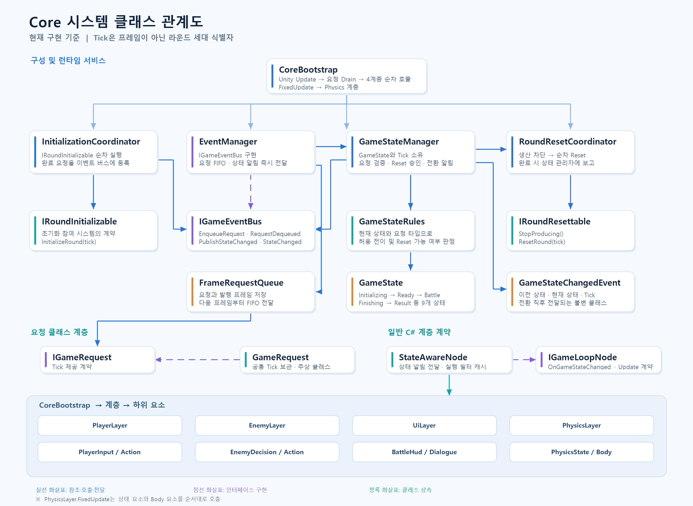

# Core 시스템 클래스 관계도

현재 구현 기준 관계도입니다. `CoreBootstrap.Update()`는 요청을 처리한 뒤 Player, Enemy, UI, Physics 계층을 순서대로 호출합니다. 각 계층은 일반 C# 하위 요소를 순서대로 호출하며, Physics의 물리 주기 작업은 `CoreBootstrap.FixedUpdate()`에서 시작합니다. `Tick`은 프레임 번호가 아니라 Reset 때 증가하는 라운드 세대 식별자입니다.

원본 코드를 변경한 뒤에는 `render-core-system-diagram.ps1`을 실행해 PNG를 다시 생성할 수 있습니다.
